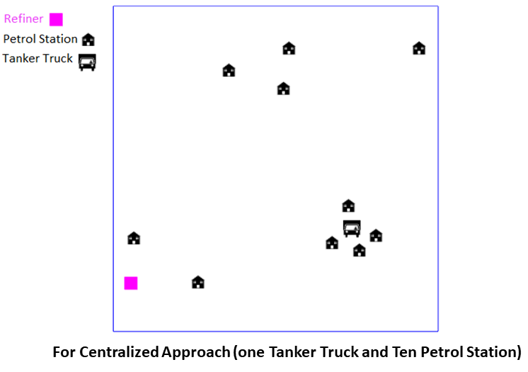

# Optimizing Petrol Distribution and Management using Decentralized Multi-Agent-Oriented Programming.

## Project Overview: 
Petrol distribution and management is a complex and challenging task, especially in countries where petrol is a scarce resource. The traditional centralized approach to petrol distribution has limitations that can result in inefficiencies, such as petrol shortages, long waiting times, and uneven distribution. To overcome these challenges, a decentralized multi-agent-oriented programming approach can be used to optimize the petrol distribution process.

Overall, this project aims to demonstrate the effectiveness of a decentralized multi-agent-oriented programming approach in optimizing the petrol distribution process. To achieve the goal, I will demonstrate a decentralized multi-agent-oriented programming approach, and compare its results with centralized approach to highlight their respective outcomes.

## Context

The project simulates a cyber-physical system where agents (like petrol stations and tanker trucks) interact with each other and the physical world through sensors and communication channels. The environment includes city-wide elements such as petrol stations, tanker trucks, consumer demand, and refineries.

### Hypotheses

1. Decentralized decision-making leads to more efficient petrol distribution compared to centralized methods.
2. Increasing the number of tanker trucks (decentralizing the delivery system) will improve delivery speed and efficiency.
3. The rules governing tanker trucks and petrol station agents significantly impact overall system performance.

### Constraints

The project operates under several constraints, including:
- Limited storage capacity at petrol stations.
- Restricted transportation capacity of tanker trucks.
- Uncertain petrol availability from refineries.
- Limited data on consumer demand.

## Multi-Agent Solution Overview

### Agents

1. **Petrol Station Agent**: Manages petrol inventory at the station and coordinates with tanker trucks to ensure timely delivery based on demand forecasts.
2. **Tanker Truck Agent**: Manages petrol delivery from refineries to petrol stations. Responds to delivery requests based on the truck's status (empty, full and assigned, or full and not assigned).

### Environment

The environment is a city-wide system consisting of petrol stations, tanker trucks, and refineries. Agents interact within this environment, with actions influenced by factors like inventory levels, demand forecasts, and the status of tanker trucks.

### Interaction

1. **Petrol Stations and Tanker Trucks**: Petrol stations send delivery requests to tanker trucks based on their inventory levels and demand forecasts. Tanker trucks respond based on their availability and current status.
2. **Tanker Trucks and Refineries**: Tanker trucks refuel at refineries when empty, queuing if necessary.

Below is the visual representation of the interaction between agents and the environment:

    

## Organization

1. **Petrol Station Agent**: Sends delivery requests based on inventory and demand forecasts.
2. **Tanker Truck Agent**: Delivers petrol based on requests from petrol stations and refuels at refineries when empty.
3. **Consumer Demand**: Generates demand for petrol, influencing the petrol station's inventory management.

## Goals

1. Optimize petrol supply to each station based on demand and availability.
2. Reduce the frequency of stock-outs at petrol stations.
3. Improve overall efficiency by comparing centralized and decentralized approaches.

## Repast Implementation

The conceptual model is implemented in a simulation using Repast. Agents like PetrolStationAgent and TankerTruckAgent are created to simulate the interactions in a city-wide environment. The simulation compares centralized and decentralized approaches by varying the number of tanker trucks.

## Evaluation

### Scenarios

1. **Centralized Approach**: One tanker truck serves multiple petrol stations, leading to potential delays and inefficiencies. Ten petrol station, one tanker truck and one refiner. (Centralized approach):

    

2. **Decentralized Approach**: Multiple tanker trucks are available, improving the efficiency of petrol delivery and reducing delays.

    

### Results

The decentralized approach shows better results in maintaining inventory levels at petrol stations, indicating a more efficient distribution process.

    

    

### Discussion

The decentralized approach is more effective for petrol distribution management, especially in scenarios with high demand and multiple petrol stations. This approach allows for independent operations and coordination, making it more scalable and adaptable than the centralized method.